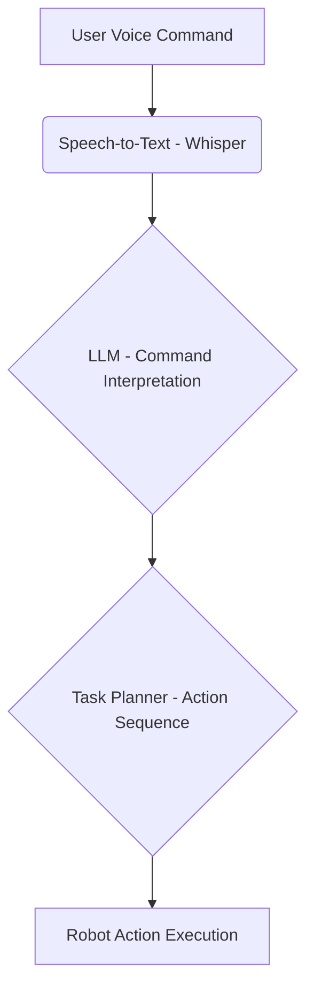

# Capstone Project: Autonomous Humanoid Robotics System

## Overview

The Capstone Project is the culminating experience of the "Physical AI & Humanoid Robotics" textbook. It challenges you to integrate all the knowledge and skills acquired throughout the various modules to design, implement, and demonstrate a fully autonomous humanoid robotics system. This project aims to simulate a complex, real-world scenario where a humanoid robot performs multi-step tasks requiring perception, cognitive planning, and physical interaction.

## Project Goal

To develop an autonomous humanoid robot that can understand natural language commands, navigate a simulated environment, identify and manipulate objects, and execute a sequence of actions to achieve a high-level goal.

## Key Features

*   **Natural Language Command Interface**: Control the robot using voice commands (e.g., "Go to the kitchen and pick up the red cup").
*   **Environmental Perception**: Utilize vision models (e.g., object detection, segmentation) to perceive and understand the simulated environment.
*   **Cognitive Planning**: Employ large language models (LLMs) to break down high-level commands into a sequence of executable low-level actions.
*   **Autonomous Navigation**: Implement robust navigation algorithms for path planning, obstacle avoidance, and localization within the simulated environment.
*   **Object Manipulation**: Develop strategies for gripping, lifting, and placing objects using the robot's end-effectors.
*   **Integrated System**: Combine ROS 2, NVIDIA Isaac Sim, vision models, and LLMs into a cohesive and functional robotic system.

## Suggested Tasks & Deliverables

*   **System Design Document**: Detail the architecture, component interactions, and data flow of your autonomous system.
*   **Voice Command Processing**: Implement a pipeline for converting spoken commands to actionable instructions.
*   **Perception Stack**: Integrate and fine-tune vision models for environmental understanding.
*   **Motion Planning & Control**: Develop inverse kinematics, trajectory generation, and low-level motor control for the humanoid robot.
*   **High-Level Task Planner**: Implement an LLM-based planner to orchestrate actions.
*   **Simulation Environment**: Set up a realistic simulation in NVIDIA Isaac Sim with relevant objects and obstacles.
*   **Demonstration**: A video demonstration of your humanoid robot executing a complex task based on natural language input.
*   **Codebase**: Well-documented and organized code repository.

## Conceptual Code Snippets & Diagrams

Throughout your project documentation, you are encouraged to include conceptual code snippets and Mermaid diagrams to illustrate your design and implementation choices. For example:

### Example: Voice Command Processing Workflow (Mermaid Diagram)



### Example: Python Snippet for Object Detection Integration

```python
import rospy
from sensor_msgs.msg import Image
from cv_bridge import CvBridge
import cv2
import numpy as np
# Assume 'object_detection_model' is a pre-loaded AI model

def image_callback(msg):
    bridge = CvBridge()
    try:
        cv_image = bridge.imgmsg_to_cv2(msg, "bgr8")
    except CvBridgeError as e:
        rospy.logerr(e)
        return

    # Perform object detection
    detections = object_detection_model.predict(cv_image)

    for detection in detections:
        # Process detection results (e.g., bounding box, class, confidence)
        x, y, w, h = detection["bbox"]
        label = detection["label"]
        confidence = detection["confidence"]

        # Publish object poses or trigger manipulation actions
        rospy.loginfo(f"Detected {label} with confidence {confidence} at ({x},{y},{w},{h})")

rospy.init_node('perception_node', anonymous=True)
image_subscriber = rospy.Subscriber('/camera/image/raw', Image, image_callback)
rospy.spin()
```

This Capstone Project provides an excellent opportunity to solidify your understanding of physical AI and humanoid robotics by building a complete, intelligent system from the ground up.
